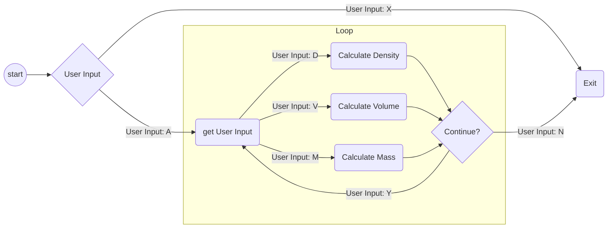

# Density Converter

A Density Converter.

## Flowchart

```mermaid
    flowchart LR
    A((start))-->B{User Input}
    B-->|User Input: X|X(Exit)
    B-->|User Input: A|C(get User Input)
    subgraph Loop
    D-->|User Input: Y|C
    C-->|User Input: D|E(Calculate Density)
    C-->|User Input: V|F(Calculate Volume)
    C-->|User Input: M|G(Calculate Mass)
    E-->D{Continue?}
    F-->D
    G-->D
    end
    D-->|User Input: N|X
```

Please change to the Dev Branch
